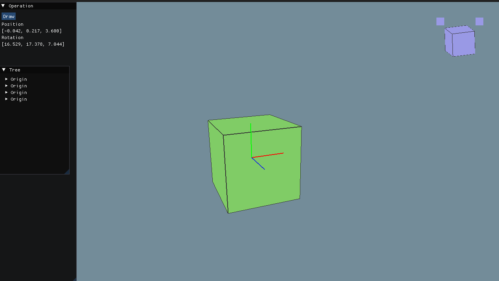
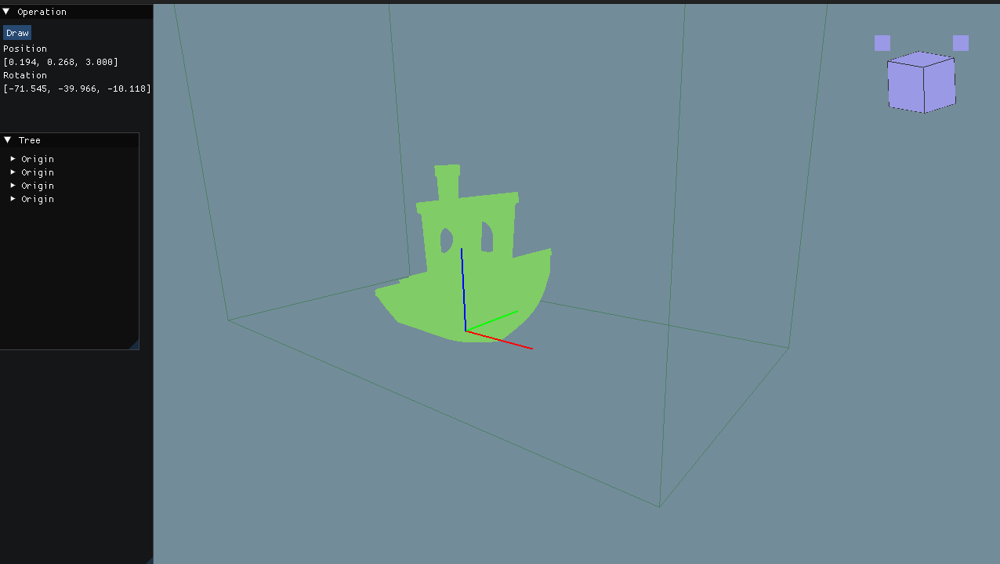

# ModelViewer

**ModelViewer** is a lightweight C++ application that allows you to preview 3D models in various common formats.

In future releases, the application will also support dimension measurement tools — making it useful for quick inspection and analysis of 3D geometry.

## Tools
- C++17
- CMake
- cppcheck
- clang-format
- clang-tidy
- pre-commit

## Libraries:
  - OpenGL
  - GLFW
  - GLM
  - Assimp
  - ImGui
